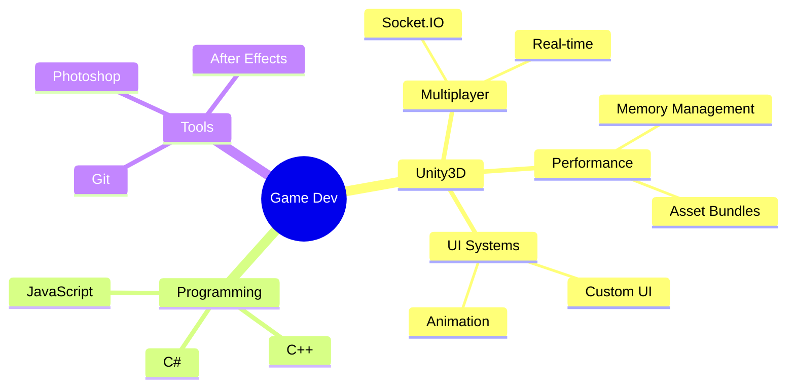

# 【Ｍａｎｊｕｎａｔｈ　ＭＰ】

<div align="center">

```ascii
  ▄████  ▄▄▄       ███▄ ▄███▓▓█████     ▓█████▄ ▓█████ ██▒   █▓
 ██▒ ▀█▒▒████▄    ▓██▒▀█▀ ██▒▓█   ▀     ▒██▀ ██▌▓█   ▀▓██░   █▒
▒██░▄▄▄░▒██  ▀█▄  ▓██    ▓██░▒███       ░██   █▌▒███   ▓██  █▒░
░▓█  ██▓░██▄▄▄▄██ ▒██    ▒██ ▒▓█  ▄     ░▓█▄   ▌▒▓█  ▄  ▒██ █░░
░▒▓███▀▒ ▓█   ▓██▒▒██▒   ░██▒░▒████▒    ░▒████▓ ░▒████▒  ▒▀█░  
 ░▒   ▒  ▒▒   ▓▒█░░ ▒░   ░  ░░░ ▒░ ░     ▒▒▓  ▒ ░░ ▒░ ░  ░ ▐░  
  ░   ░   ▒   ▒▒ ░░  ░      ░ ░ ░  ░     ░ ▒  ▒  ░ ░  ░  ░ ░░  
░ ░   ░   ░   ▒   ░      ░      ░        ░ ░  ░    ░       ░░  
      ░       ░  ░       ░      ░  ░       ░       ░  ░     ░  
```


</div>


## 🎮 Player Stats

```cs
public class GameDeveloper : MonoBehaviour
{
    public string Name = "Manjunath MP";
    public string Class = "Unity Developer";
    public int Level = 3; // Years of Experience
    public string[] ActiveQuests = 
    {
        "Multiplayer Casino Games",
        "Advanced Design Patterns",
        "Performance Optimization"
    };
}
```

## ⚔️ Skill Tree

<div align="center">



</div>

## 🎲 Main Quests

```ascii
⚔️ Enixo Studio
│  └─ Casino Games Development
│     └─ Real-time Systems, Asset Optimization
│
🎯 Appcake
│  └─ iOS Gaming Applications
│     └─ Performance & UI Systems
│
🎲 Outscal Technologies
   └─ Unity Game Development
      └─ Core Gaming Systems
```

## 🎮 Side Quests

<div align="center">

| Project | Tech Stack | Key Features |
|:-------:|:----------:|:------------:|
| 🎯 Balance 3D | Unity, C# | `Gyroscope Controls` `Event Systems` `Mobile` |
| 🚀 Battle Tank 3D | Unity, C# | `MVC Pattern` `State Machine` `AI` |
| 🐍 Snake 2D | Unity, C# | `Power-up System` `Custom UI` `Scenes` |
| 💫 Pop Blast | Unity, C# | `Level Generator` `Mobile` `Effects` |

</div>

## 🌟 Power-Ups

<div align="center">

```ascii
⚔️ SKILL POINTS ⚔️
┌────────────────────────┐
│  Unity         ████████│
│  Networking    ███████ │
│  Optimization  ████████│
│  UI Systems    ██████  │
└────────────────────────┘
```


</div>

## 🌐 Join Party

<div align="center">

[](https://mppavan05.wixsite.com/pavanpf)
[](https://www.linkedin.com/in/manjunath-mp-b53a1b19b)
[](mailto:mppavan05@gmail.com)

</div>

## 🐍 Contribution Grid


<div align="center">

```ascii
GAME SAVED ✔️
INSERT COIN TO CONTINUE...
```


</div>
