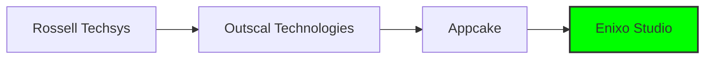

# 
🎮 Manjunath MP | Game Developer 🎮

## About Me 🚀

Professional Game Developer with extensive experience in Unity3D, specializing in multiplayer casino games and mobile game development. Passionate about creating immersive gaming experiences and optimizing performance.

- 🎯 Currently leading game development at **Enixo Studio**
- 🌟 Specialized in **Multiplayer Systems** & **Casino Games**
- 🔧 Expert in **Unity3D**, **C#**, and **Networking**
- 🎨 Proficient in **UI/UX Design** & **Performance Optimization**
- 🌱 Currently exploring **Advanced Design Patterns** & **Shader Programming**

## Technical Arsenal 🛠️

### Game Development

### Programming & Tools

### Creative Tools

## Featured Projects 🎮

### Casino Games Portfolio
- 🎲 Developed multiplayer casino games with real-time synchronization
- 🔄 Implemented efficient asset bundle systems
- 📱 Optimized for mobile platforms
- 🌐 Integrated networking solutions using Socket.IO

### Notable Personal Projects

#### 🎯 Balance 3D ([View Project](https://github.com/yourusername/Balance3D))
- Gyro-controlled 3D adventure game
- Custom event system
- Advanced input handling
- Mobile optimization

#### 🎮 Battle Tank 3D ([View Project](https://github.com/yourusername/BattleTank3D))
- MVC Architecture
- State Design Pattern
- Scriptable Objects
- Custom AI system

## Professional Journey 💼

## Let's Connect! 🤝

## GitHub Stats 📊

## Contribution Graph 🐍

---

    

