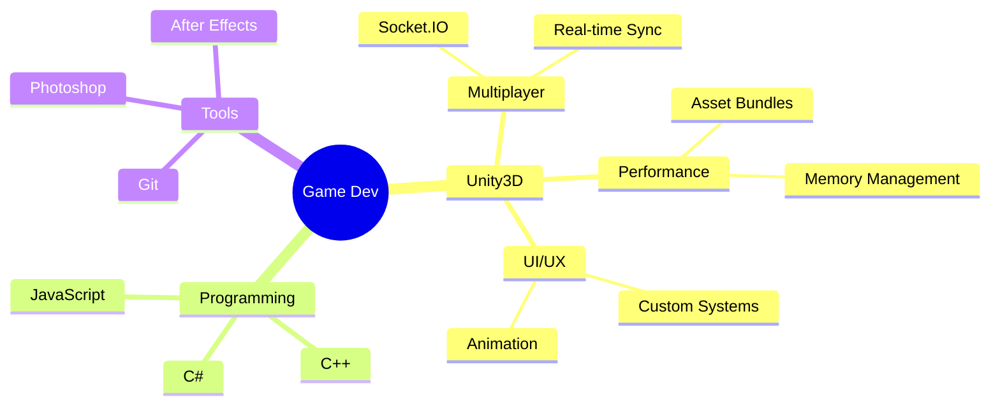

# 【Ｍａｎｊｕｎａｔｈ　ＭＰ】

<div align="center">

```ascii
  ▄████  ▄▄▄       ███▄ ▄███▓▓█████     ▓█████▄ ▓█████ ██▒   █▓
 ██▒ ▀█▒▒████▄    ▓██▒▀█▀ ██▒▓█   ▀     ▒██▀ ██▌▓█   ▀▓██░   █▒
▒██░▄▄▄░▒██  ▀█▄  ▓██    ▓██░▒███       ░██   █▌▒███   ▓██  █▒░
░▓█  ██▓░██▄▄▄▄██ ▒██    ▒██ ▒▓█  ▄     ░▓█▄   ▌▒▓█  ▄  ▒██ █░░
░▒▓███▀▒ ▓█   ▓██▒▒██▒   ░██▒░▒████▒    ░▒████▓ ░▒████▒  ▒▀█░  
 ░▒   ▒  ▒▒   ▓▒█░░ ▒░   ░  ░░░ ▒░ ░     ▒▒▓  ▒ ░░ ▒░ ░  ░ ▐░  
  ░   ░   ▒   ▒▒ ░░  ░      ░ ░ ░  ░     ░ ▒  ▒  ░ ░  ░  ░ ░░  
░ ░   ░   ░   ▒   ░      ░      ░        ░ ░  ░    ░       ░░  
      ░       ░  ░       ░      ░  ░       ░       ░  ░     ░  
```


</div>


## 🎮 Player Stats

```cs
public class GameDeveloper : MonoBehaviour
{
    public string Name = "Manjunath MP";
    public string Class = "Unity Developer";
    public int Level = 3; // Years of Experience
    public string[] ActiveQuests = 
    {
        "Multiplayer Casino Games",
        "Advanced Design Patterns",
        "Performance Optimization"
    };
}
```

## 🏆 Achievement Unlocks

```
🎯 ACHIEVEMENT UNLOCKED: Led Development at Enixo Studio
⚔️ ACHIEVEMENT UNLOCKED: Mastered Multiplayer Systems
🎲 ACHIEVEMENT UNLOCKED: Casino Game Architecture Expert
🚀 ACHIEVEMENT UNLOCKED: Mobile Performance Guru
```

## ⚔️ Skill Tree

<div align="center">



</div>

## 🎲 Main Quests (Experience)

```ascii
⚔️ Enixo Studio (2022 - Present)
│  └─ Legendary Items: Multiplayer Casino Games
│     └─ Enchantments: Real-time Sync, Asset Optimization
│
🗡️ Appcake (2022)
│  └─ Rare Items: iOS Gaming Applications
│     └─ Enchantments: Performance Optimization
│
🏹 Outscal Technologies (2021 - 2022)
   └─ Epic Items: Multiple Unity Games
      └─ Enchantments: Industry Standards, Agile Development
```

## 🎮 Side Quests (Projects)

<div align="center">

| Project | Tech Stack | Features |
|:-------:|:----------:|:--------:|
| 🎯 Balance 3D | Unity, C# | `Gyro Controls` `Custom Events` `Mobile` |
| 🚀 Battle Tank 3D | Unity, C# | `MVC` `State Pattern` `AI` |
| 🐍 Snake 2D | Unity, C# | `Power-ups` `Custom UI` `Scenes` |
| 💥 Pop Blast | Unity, C# | `Endless Levels` `Mobile` `Arcade` |

</div>

## 🌟 Power-Ups (Skills)

<div align="center">


</div>

## 📊 Player Stats

<div align="center">

```ascii
⚔️ COMBAT STATS ⚔️
┌────────────────────────┐
│  Unity         ████████│
│  Networking    ███████ │
│  Optimization  ████████│
│  UI/UX         ██████  │
└────────────────────────┘
```


</div>

## 🌐 Join My Party

<div align="center">

[](https://mppavan05.wixsite.com/pavanpf)
[](https://www.linkedin.com/in/manjunath-mp-b53a1b19b)
[](mailto:mppavan05@gmail.com)

</div>

## 🐍 Contribution Snake


<div align="center">

```ascii
GAME SAVED ✔️
INSERT COIN TO CONTINUE...
```


</div>
